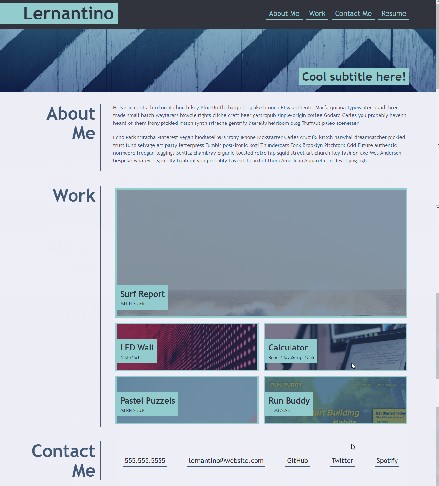

# Vladimir Berka's Homework #2, UW Bootcamp

## Assignment Description
This is a homework assignment for the UW Bootcamp that serves as a capstone to all HTML and CSS learned to date (3/2/22). The goal of the assignment is to create a portfolio webpage from scratch for potential employers and hiring managers to view. HTML files + the styles.CSS file were written without a template. A standardized reset.css file was used. Additional image PNG and JPG files were sourced for visual improvement. 

The original user story and acceptance criteria for the assignment is copied to the end of this document.

## Assignment Scope
Create a personal webpage to advertise and consolidate web development work. The content of the webpage is to include links to social media + github, an "about me" summary, and several image hyperlinks to completed web development work.   

The design intent of the chosen layout was to replicate a mockup provided by the instructor, copied to the end of this document.

## Generalized Tasks
- Create an accessible digital space to store and access completed web development work
- Provide contact information and general personal information w/ social media links
- Create image links out to GitHub with screenshots to completed web development work
- Create a responsive layout that changes and adapts to various user screens 
- Organize the web page using flex-box elements and continue using semantic HTML tags
- Push to GitHub

## Summary of Work Completed
The web page was organized using flexbox and nested flexbox elements. This by design allowed for a pseudo-responsive webpage that adjusted it's layout to varying viewport widths and sizes. @Media queries were added to further improve responsiveness and apperance for mobile browser settings. The overall visual layout of the webpage was divided into two columns with descriptive headers to the left and primary content to the right. A header and footer were provided for generic navigational links to either local anchors in the webpage or external hyperlinks to social media and other content. Images were provided for apperance and granted an opacity with the :hover pseudoclass to indicate external links were present. 

## List of Files
* README.md - This current read me file
* index.html - HTML file for the initial website
* ~./assets/css/style.css - CSS files for the above noted website in the css subdirectory of the assets directory
* ~./assets/css/reset.css - Standard CSS reset file to allow custom edits
* .gitignore - Git Ignore file for some files not used
* ~./images/... - Several PNG and JPG images of either screenshots, placeholder images, and personal images

# Original Homework Assignment Details

## User Story

```
AS AN employer
I WANT to view a potential employee's deployed portfolio of work samples
SO THAT I can review samples of their work and assess whether they're a good candidate for an open position
```

## Acceptance Criteria

Here are the critical requirements necessary to develop a portfolio that satisfies a typical hiring manager’s needs:

```
GIVEN I need to sample a potential employee's previous work
WHEN I load their portfolio
THEN I am presented with the developer's name, a recent photo or avatar, and links to sections about them, their work, and how to contact them
WHEN I click one of the links in the navigation
THEN the UI scrolls to the corresponding section
WHEN I click on the link to the section about their work
THEN the UI scrolls to a section with titled images of the developer's applications
WHEN I am presented with the developer's first application
THEN that application's image should be larger in size than the others
WHEN I click on the images of the applications
THEN I am taken to that deployed application
WHEN I resize the page or view the site on various screens and devices
THEN I am presented with a responsive layout that adapts to my viewport
```

## Screenshot of Webpage


## Screenshot of Mockup



## License
MIT License

Copyright (c) [2022] [Vladimir Berka]

Permission is hereby granted, free of charge, to any person obtaining a copy
of this software and associated documentation files (the "Software"), to deal
in the Software without restriction, including without limitation the rights
to use, copy, modify, merge, publish, distribute, sublicense, and/or sell
copies of the Software, and to permit persons to whom the Software is
furnished to do so, subject to the following conditions:

The above copyright notice and this permission notice shall be included in all
copies or substantial portions of the Software.

THE SOFTWARE IS PROVIDED "AS IS", WITHOUT WARRANTY OF ANY KIND, EXPRESS OR
IMPLIED, INCLUDING BUT NOT LIMITED TO THE WARRANTIES OF MERCHANTABILITY,
FITNESS FOR A PARTICULAR PURPOSE AND NONINFRINGEMENT. IN NO EVENT SHALL THE
AUTHORS OR COPYRIGHT HOLDERS BE LIABLE FOR ANY CLAIM, DAMAGES OR OTHER
LIABILITY, WHETHER IN AN ACTION OF CONTRACT, TORT OR OTHERWISE, ARISING FROM,
OUT OF OR IN CONNECTION WITH THE SOFTWARE OR THE USE OR OTHER DEALINGS IN THE
SOFTWARE.